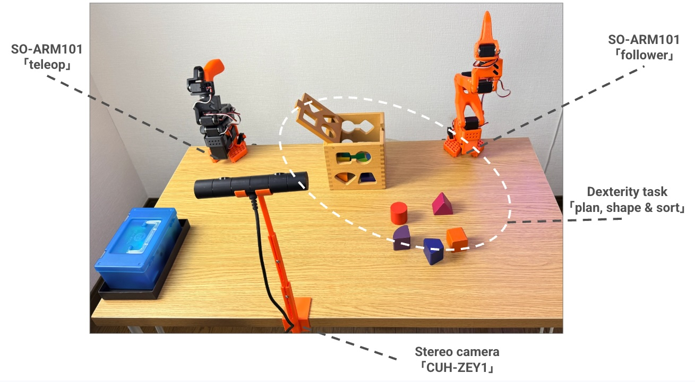

# 🎛️ r2b_safety_lab (Robotic Risk Bench)

  

### Bridging General Activity Learning and Safety in Low-Cost Robotics

## 🌟 Vision & Philosophy

The **R2B (Robotic Risk Bench)** project is founded on a core belief: **Robotic safety must be achieved jointly with general activity learning and world modeling.** Safety should not be an afterthought or a separate "wrapper" around an agent; it must be an intrinsic part of how robots interact with and learn from their environment. We aim to decompose this challenge into actionable engineering steps, improving academic research and supporting the community in reliabily deploy safer robots to the physical world.

## 🏗️ Current Focus: SO-ARM101

Keep up to date to what is happening on the bench

| Description          | Status   | Read more                                    |
| -------------------- | -------- | -------------------------------------------- |
| Object, Key, Results | On going | [Q1/2026 report](docs/progress-report-q1.md) |

### The bench is currently in the V1 phase.

We are currently utilizing the **SO-ARM101** platform.

- **Why?** Its open-source nature and low-cost entry point make it the ideal "hackable" candidate for stress-testing safety protocols.
- **Challenge:** Low-cost servos often lack the deterministic feedback of industrial actuators. We are documenting how to bridge this "Reliability Gap" through better perception and control.

## 🧪 Research & Development Areas

### 1. Safety-Aware Learning

How can we reward a model for task success while penalizing "near-miss" safety violations? We are experimenting with different simulation environments to find the optimal balance of speed, low-cost overhead, and physical accuracy.

### 2. Computer Vision for Robotics (CVRS 101)

As part of this repository, I am developing **Lecture Notes: Computer Vision for Robotic Systems 101**.

- Focus: Real-time object detection, depth estimation, and visual servoing for safety-critical tasks.
<!-- - [View Lecture Notes Directory](./lectures/CVRS_101) _(Work in Progress)_ -->

### 3. Simulation to Reality (Sim2Real)

Evaluating simulators (Isaac Gym, MuJoCo, Gazebo) for their ability to model failure modes—not just success paths.

## 📁 What to Expect from this Repository

- **Open-Source Training Material:** Guides and weights for training the robots.
- **Safety Trends:** Curated insights and summaries from the latest academic literature on robotic safety.
- **Technical Benchmarks:** Documentation on the latency and reliability of low-cost robotic components.
- **Educational Content:** Full course materials for CVRS 101.

---

## 🤝 Contributing & Updates

This is a living lab. We provide general updates on the intersection of robotics and safety. If you are interested in the academic side or the hands-on robotics implementation, we welcome discussions.

**License:** MIT
**Year:** 2026

# Support

Many of you asked how to support my research, so I’ve set up a page on [ :coffee: Buy me a coffee](https://buymeacoffee.com/rafafelixphd). I truly appreciate the help!
