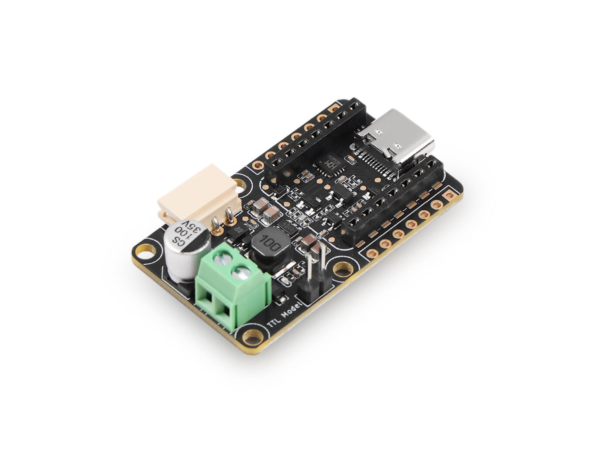

# Frequently Asked Questions

---

## SO-ARM101

> [!NOTE]
> This section is for the SO-ARM101 robot.
> Original repository: https://github.com/TheRobotStudio/SO-ARM100
> Calibrating steps: https://huggingface.co/docs/lerobot/so101

### Camera Compatibility

The robotic arm typically utilizes a `32x32 Camera Module`. This type of camera is inexpensive and widely accessible through various online retailers.

Note, that you will find in `usb` and `csi` versions. The `csi` is common to run with `raspberry pi` boards, while the `usb` is common to run directly from the computer.

> More about cameras usage: https://huggingface.co/docs/lerobot/cameras

### Power Supply Requirements

The standard power supply for the robotic arm is a `5V 2A Power Supply`.

However, a frequent modification involves redesigning the robot to operate on a `12V 2A Power Supply`. This change is common when upgrading the follower arm with a `12V motor` in place of the original `5V motor`.

### Motor Controller Unit/Board

Most kits sell this version of the MCU.

> Bus Servo Driver Board for Seeed Studio XIAO
> SKU 105990190
> 

Important to note in this unit, its the access to power supply. It uses a `2.54mm pitch 2-pin terminal block` connector.

### Learning how to teleoperate the robot

> https://huggingface.co/docs/lerobot/il_robots?teleoperate_so101=API+example
