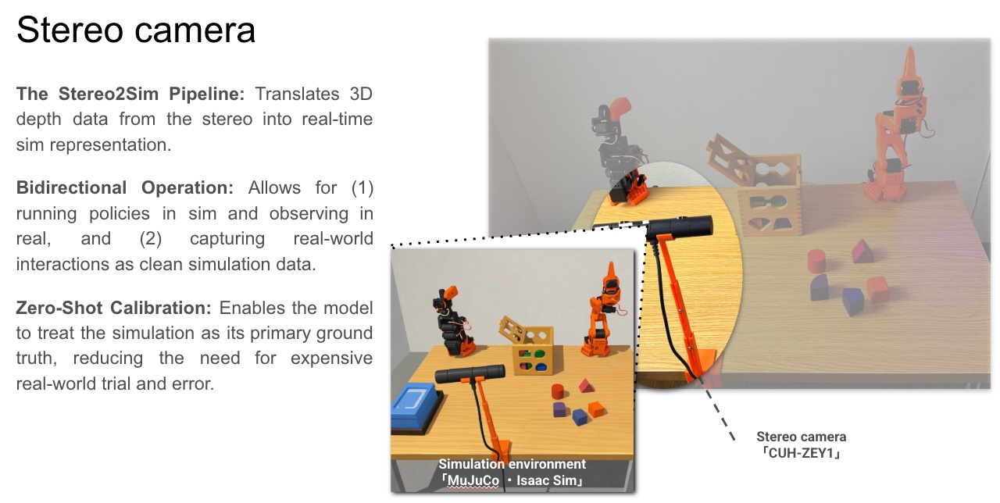

# 🤖 R2B: Project Roadmap Q1 2026

**Mission:** Researching **Zero-Shot Safety**—teaching robots to avoid hazards they’ve never seen before.

---

### 🎯 The Goal: Sim2Real Safety Bridge

By the end of Q1 2026, the robot will use a real-time **Digital Twin** to predict and avoid physical risks before they happen.

---

### 🛠 Phase 1: The Build (January)

- **Status:** ✅ **Complete**
- **Milestones:** \* Assembled **SO-ARM101** (Leader & Follower units).
  - Established basic motor control & Python CLI.
  - Integrated **CUH-ZEY1** Stereo Camera for 3D depth perception.

### 🧠 Phase 2: The Digital Twin (February)

- **Status:** 🔵 **In Progress**
- **Milestones:**
  - **Stereo2Sim:** Map real-world room depth directly into **MuJoCo** simulation.
  - **Multi-View Sync:** Connect Raspberry Pi (Ego-view) + Stereo (Global-view) cameras.
  - **Sim-Teleop:** Control the physical arm via its digital twin.

[Image of a digital twin of a robotic arm in simulation]

### ⚠️ Phase 3: Zero-Shot Safety (March)

- **Status:** ⚪ **Pending**
- **Milestones:**
  - **Hazard Injection:** Program "Digital Risks" (spills, fire, obstacles) into the sim.
  - **Policy Training:** Fine-tune VLA models to recognize and bypass simulated hazards.
  - **Technical Artifact:** Release the first **Video-Paper** on safety-failure analysis.

---

### 📦 Tech Stack

- **Hardware:** SO-ARM101, Raspberry Pi 5, PS4 Stereo Camera.
- **Software:** MuJoCo, LeRobot (Hugging Face), Python.
- **Research:** VLA (Vision-Language-Action) & Zero-Shot Learning.

---

### 🤝 Join the Research

Building in public to bridge the gap between labs and the world.

- **Collaborate:** Open to MuJoCo/VLA experts.
- **Updates:** Weekly technical breakthroughs posted here.

> _"The frontier of robotics belongs on the digital frontier. Let’s build it open."_
